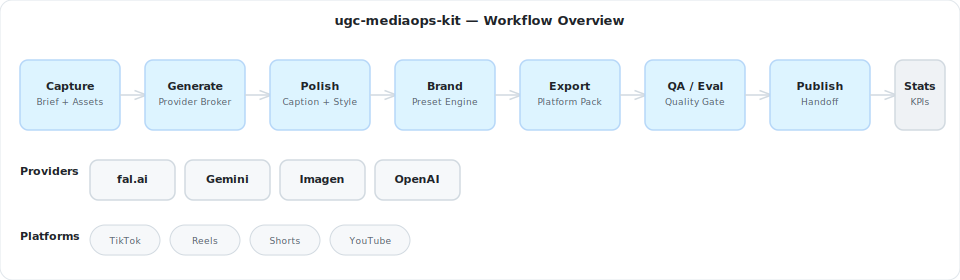
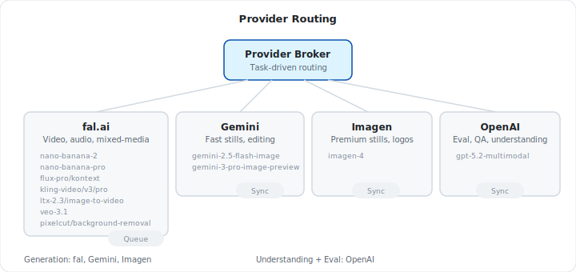

# ugc-mediaops-kit

Open-source finishing pipeline for agency UGC and generative media workflows.

**Brief → Generate → Polish → Export → Evaluate → Publish**

[Website](https://insightpulseai.com) · [Architecture](docs/architecture/OVERVIEW.md) · [Provider Policy](docs/architecture/PROVIDER_POLICY.md) · [fal Integration](docs/architecture/FAL_INTEGRATION_STRATEGY.md)

---

ugc-mediaops-kit is the reusable workflow layer between generation and publishing. It standardizes briefs, provider routing, finishing, brand presets, platform exports, QA, and publish handoff for agency UGC and generative media workflows.

AI can generate assets. The bottleneck is everything after: formatting, branding, QA, export packaging, and publish handoff. This pipeline closes that gap.

## Getting started

ugc-mediaops-kit is currently an open-source architecture and workflow skeleton.

Start here:

- Read the [architecture overview](docs/architecture/OVERVIEW.md)
- Review the [provider policy](docs/architecture/PROVIDER_POLICY.md)
- Review the [fal integration strategy](docs/architecture/FAL_INTEGRATION_STRATEGY.md)
- Explore the `schemas/`, `providers/`, `pipeline/`, `evals/`, and `examples/` directories

This project is being built in stages:

- **v0.1** — schemas + provider broker + manifest workflow
- **v0.2** — polish/export/QA pipeline + n8n workflow templates
- **v0.2.5** — platform ops wrapper
- **v0.3** — analytics schema + recommendation loop

## What it does

- **Creative Briefs** — standardize intake for brand, audience, and platform targets
- **Provider Broker** — route jobs across fal, Gemini, Imagen, and OpenAI by modality and quality tier
- **Brand Presets** — enforce fonts, colors, watermarks, subtitle styles, and title-safe rules as code
- **Export Profiles** — package outputs for TikTok, Reels, Shorts, YouTube, 1:1, 16:9, and 9:16
- **QA / Eval** — catch caption, aspect-ratio, brand, and output-coverage issues before publish
- **Publish Handoff** — emit scheduler-ready, platform-ready payloads
- **Analytics** — normalize performance signals for next-brief recommendations

## Visual architecture

### Workflow overview



### Provider routing



### Brief to publish lifecycle


## Provider split

| Provider | Role | Mode |
|----------|------|------|
| **fal.ai** | Video, audio, mixed-media generation, utility transforms | Queue + webhook |
| **Gemini** | Fast stills, conversational editing, concepting | Synchronous |
| **Imagen** | Premium-quality stills, logos, brand-critical visuals | Synchronous |
| **OpenAI multimodal** | Understanding, evaluation, QA, extraction | Synchronous |

Generation providers produce assets. OpenAI evaluates and reviews them. The broker routes jobs to the right provider based on modality and quality tier.

### Model map

| Job | Provider | Model |
|-----|----------|-------|
| `still.generate.fast` | fal | `nano-banana-2` |
| `still.generate.premium` | fal | `nano-banana-pro` |
| `still.edit.brand` | fal | `flux-pro/kontext` |
| `video.generate.premium` | fal | `kling-video/v3/pro/image-to-video` |
| `video.generate.fast` | fal | `ltx-2.3/image-to-video/fast` |
| `video.generate.google` | fal | `veo-3.1` |
| `asset.remove_background` | fal | `pixelcut/background-removal` |
| `asset.upscale` | fal | `seedvr/upscale/image` |
| `asset.to_lottie` | fal | `omnilottie/image-to-lottie` |
| `asset.to_svg` | fal | `vecglypher/image-to-svg` |

### fal integration layers

| Layer | fal Surface | Module | Phase |
|-------|------------|--------|-------|
| Generation | Model APIs | `providers/fal/` | v0.1 |
| Orchestration | n8n integration | `pipeline/` | v0.1 |
| Platform ops | Platform APIs | planned | v0.2 |
| Custom deploy | CLI + Python SDK | deferred | v0.3+ |

Generation goes through Model APIs. Platform APIs are for metadata, pricing, usage, and analytics — never for executing model calls.

## Project structure

```text
schemas/      # JSON schemas for briefs, jobs, presets, exports, publish plans, reports
providers/    # Provider adapters and broker integrations
  fal/        # fal.ai — video, audio, mixed-media, utilities
  gemini/     # Gemini — fast stills, editing
  imagen/     # Imagen — premium stills
  openai/     # OpenAI — eval, QA, understanding
pipeline/     # Workflow runner from brief to export
evals/        # QA and evaluation checks
examples/     # Example workflows and manifests
docs/         # Architecture and policy docs
site/         # Project microsite (Next.js)
```

## Documentation

- [Architecture Overview](docs/architecture/OVERVIEW.md) — system context, services, pipeline stages, output model
- [Provider Policy](docs/architecture/PROVIDER_POLICY.md) — provider routing doctrine and model shortlist
- [fal Integration Strategy](docs/architecture/FAL_INTEGRATION_STRATEGY.md) — four-layer fal integration architecture

## Community

This project is intended as an open-source foundation for studios, agencies, and media workflow engineers building the finishing layer between generation and publishing.

Abstracted from the operating workflow of a physical creative studio (508.25 sqm, Makati City). The product promise: "Shoot at 9AM. Publish the same day."

## Security

If this project later includes secrets-handling, webhook verification, or provider key management examples, security-sensitive issues should be reported privately rather than opened as public exploit issues.

## Contributing

Contributions are welcome across:

- schemas
- provider adapters
- workflow templates
- QA/eval rules
- documentation
- examples

## License

[Apache 2.0](LICENSE)

---

Built by [InsightPulse AI](https://insightpulseai.com)
